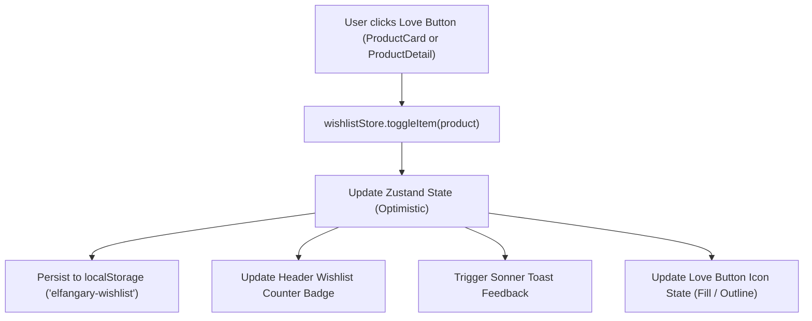

# Feature Plan 01: Customer Wishlist & Love (Heart) Button System

## 1. Executive Summary
This document outlines the architecture, UX/UI specifications, data model, state management, and step-by-step implementation plan for introducing a **Customer Wishlist** feature with an interactive **Love (Heart ❤️) Button** on both **Item Cards** and **Item Detail Pages** in the **Elfangary Frontstore** (Headless Shopify + Next.js App Router).

The wishlist allows users to save favorite honey products and bundles for later purchase, view their saved items on a dedicated luxury wishlist page, manage items effortlessly with micro-animations, and move items directly into the shopping cart.

---

## 2. Love (Heart ❤️) Button Specifications

### 2.1 Item Card (`ProductCard.tsx`)
- **Placement**: Top corner of the product image card (positioned absolutely `absolute top-3 end-3 z-30`).
- **Visual Design**:
  - Glassmorphism circular badge: `h-9 w-9 rounded-full bg-white/80 backdrop-blur-md shadow-sm border border-white/50 flex items-center justify-center transition-all duration-300 hover:bg-white hover:scale-110 active:scale-95`.
  - Contrasts clearly against both light and dark product photography.
- **Icon & States**:
  - **Inactive (Not in Wishlist)**: Outlined heart (`h-4 w-4 text-ink-dark/70 transition-colors group-hover/wishlist:text-brand-orange`).
  - **Active (In Wishlist)**: Filled red/orange heart (`h-4 w-4 text-red-500 fill-red-500 animate-in zoom-in-50 duration-200`).
- **Click Behavior**:
  - `e.preventDefault()` & `e.stopPropagation()` strictly enforced to prevent triggering the product detail navigation.
  - Triggers optimistic toggle in `wishlistStore`.
  - Displays lightweight toast confirmation: *"تمت الإضافة إلى المفضلة"* / *"تمت الإزالة من المفضلة"*.

### 2.2 Item Detail Page (`ProductDetail.tsx`)
- **Placement 1: Action Bar (Next to Add to Cart & Buy Now)**:
  - Positioned directly beside the primary action buttons: `[ Add to Cart ] [ Buy Now ] [ ❤️ Love Button ]`.
  - Sized comfortably (`h-12 w-12` or pill button `px-4 h-12 flex items-center gap-2 rounded-btn border border-ink-dark/15 hover:border-brand-orange hover:bg-brand-orange/5 transition-all`).
  - Shows heart icon + dynamic text: *"أضف للمفضلة"* when unselected, *"في المفضلة"* with filled heart when selected.
- **Placement 2: Floating Gallery Overlay (Mobile & Desktop Quick Access)**:
  - Top corner overlay on the product media gallery (`ProductGallery.tsx`).
  - Allows quick favoriting while zooming or sliding through product images.
- **Micro-Animations**:
  - Heart bounce & pulse effect upon activation.
  - Real-time synchronization: Toggling on the page updates the header count and card states across the site immediately.

---

## 3. Global Wishlist Architecture & State Management

### 3.1 Data Flow Diagram


### 3.2 File Structure
```
elfangary-frontstore/
├── store/
│   └── wishlistStore.ts               # [NEW] Zustand store with localStorage persistence
├── components/
│   ├── WishlistButton.tsx             # [NEW] Reusable Love Button with icon/pill variants
│   ├── WishlistPageClient.tsx         # [NEW] Interactive Wishlist page view
│   ├── HeaderClient.tsx               # [MODIFY] Wishlist icon & live count badge
│   ├── ProductCard.tsx                # [MODIFY] Embed Love Button on top-corner of card
│   ├── ProductDetail.tsx              # [MODIFY] Embed Love Button in CTA action group
│   └── ProductGallery.tsx             # [MODIFY] Embed floating Love Button on gallery
├── app/
│   └── [locale]/
│       └── wishlist/
│           └── page.tsx               # [NEW] Dedicated Wishlist page route
└── i18n/
    └── messages/
        ├── ar.json                    # [MODIFY] Arabic strings for Wishlist & Love button
        └── en.json                    # [MODIFY] English strings for Wishlist & Love button
```

---

## 4. Technical Component Implementation Details

### 4.1 Wishlist Store (`store/wishlistStore.ts`)
```typescript
export interface WishlistItem {
  id: string; // Product GraphQL ID
  handle: string;
  title: string;
  vendor?: string;
  featuredImage?: {
    url: string;
    altText?: string;
  };
  priceRange?: {
    minVariantPrice: { amount: string; currencyCode: string };
    maxVariantPrice: { amount: string; currencyCode: string };
  };
  compareAtPriceRange?: {
    minVariantPrice: { amount: string; currencyCode: string };
  };
  availableForSale: boolean;
  addedAt: number;
}

interface WishlistState {
  items: WishlistItem[];
  addItem: (item: Omit<WishlistItem, 'addedAt'>) => void;
  removeItem: (id: string) => void;
  toggleItem: (item: Omit<WishlistItem, 'addedAt'>) => boolean; // returns true if added, false if removed
  isInWishlist: (id: string) => boolean;
  clearWishlist: () => void;
  count: () => number;
}
```

### 4.2 Love Button Component (`components/WishlistButton.tsx`)
```typescript
interface WishlistButtonProps {
  product: Product;
  variant?: "floating" | "icon" | "full" | "pill";
  showLabel?: boolean;
  className?: string;
}
```
- **Variants**:
  - `floating`: Circular glassmorphic button for `ProductCard` & `ProductGallery` overlays.
  - `icon`: Square/rounded button for action toolbars.
  - `pill` / `full`: Large button with label *"أضف إلى المفضلة"* / *"في المفضلة"* for `ProductDetail`.

### 4.3 Header Wishlist Counter (`components/HeaderClient.tsx`)
- Adds a `<Link href={localePath(locale, "wishlist")}>` next to Account and Cart buttons.
- Features a responsive counter badge:
  ```tsx
  <Link href={locale === "en" ? "/en/wishlist" : "/wishlist"} className="btn-ghost relative h-7 w-7 sm:h-8 sm:w-8 p-0" aria-label="Wishlist">
    <Heart className="h-4 w-4" />
    {mounted && wishlistCount > 0 && (
      <span className="absolute -end-0.5 -top-0.5 flex h-4 min-w-4 items-center justify-center rounded-full bg-brand-orange px-1 text-[9px] font-bold text-white animate-in zoom-in">
        {wishlistCount}
      </span>
    )}
  </Link>
  ```

### 4.4 Dedicated Wishlist Page (`app/[locale]/wishlist/page.tsx` & `WishlistPageClient.tsx`)
- **Features**:
  - Responsive luxury product grid matching Elfangary brand theme.
  - Quick "Move to Cart" button (adds to cart, removes from wishlist, opens cart drawer).
  - Batch "Move all to cart" button.
  - "Clear wishlist" with confirmation.
  - Rich empty state with high-resolution styling and direct link to shop.

---

## 5. Internationalization Strings (i18n)

### `i18n/messages/ar.json`
```json
"Wishlist": {
  "title": "قائمة المفضلة",
  "emptyTitle": "قائمتك المفضلة فارغة",
  "emptySubtitle": "لم تقم بإضافة أي منتجات إلى قائمة رغباتك بعد. استكشف تشكيلة العسل الفاخر واضغط على زر الإعجاب لحفظ ما يعجبك!",
  "exploreShop": "استكشف المنتجات",
  "added": "تمت إضافة المنتج إلى المفضلة",
  "removed": "تمت إزالة المنتج من المفضلة",
  "addToWishlist": "إضافة للمفضلة",
  "inWishlist": "في المفضلة",
  "moveToCart": "نقل إلى السلة",
  "moveAllToCart": "إضافة الكل إلى السلة",
  "allMovedToCart": "تمت إضافة جميع المنتجات المتوفرة إلى السلة",
  "clearAll": "إفراغ القائمة",
  "confirmClear": "هل أنت متأكد من رغبتك في إفراغ قائمة المفضلة؟",
  "itemsCount": "{count} منتج في المفضلة",
  "shareWishlist": "مشاركة المفضلة",
  "copiedLink": "تم نسخ رابط المفضلة"
}
```

### `i18n/messages/en.json`
```json
"Wishlist": {
  "title": "My Wishlist",
  "emptyTitle": "Your Wishlist is Empty",
  "emptySubtitle": "You haven't added any products to your wishlist yet. Explore our luxury honey collection and click the love icon to save your favorites!",
  "exploreShop": "Explore Shop",
  "added": "Added to wishlist",
  "removed": "Removed from wishlist",
  "addToWishlist": "Add to Wishlist",
  "inWishlist": "In Wishlist",
  "moveToCart": "Move to Cart",
  "moveAllToCart": "Add All to Cart",
  "allMovedToCart": "All available items added to cart",
  "clearAll": "Clear Wishlist",
  "confirmClear": "Are you sure you want to clear your wishlist?",
  "itemsCount": "{count} items in wishlist",
  "shareWishlist": "Share Wishlist",
  "copiedLink": "Wishlist link copied"
}
```

---

## 6. Implementation Stages & Checklist

- [ ] **Stage 1: State & Storage Layer**
  - Create `store/wishlistStore.ts` with Zustand and localStorage persistence.
- [ ] **Stage 2: Love Button Component & Product Integration**
  - Create `components/WishlistButton.tsx` supporting floating, icon, and pill modes with smooth heart animations.
  - Integrate floating Love Button on `components/ProductCard.tsx` (top-corner image badge).
  - Integrate Love Button on `components/ProductDetail.tsx` (action row beside Add to Cart / Buy Now) and `components/ProductGallery.tsx`.
- [ ] **Stage 3: Header Integration**
  - Update `components/HeaderClient.tsx` with Heart icon and real-time counter badge.
- [ ] **Stage 4: Dedicated Wishlist Page**
  - Create `app/[locale]/wishlist/page.tsx` server route.
  - Create `components/WishlistPageClient.tsx` client view with single/batch "Move to Cart" and rich empty state.
- [ ] **Stage 5: Internationalization**
  - Add translation keys to `i18n/messages/ar.json` and `i18n/messages/en.json`.
- [ ] **Stage 6: Verification & QA**
  - Verify Love button responsiveness, toggle state persistence, no event bubbling on cards, and smooth cart transitions.
