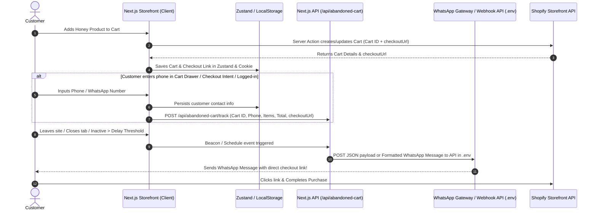

# Feature Plan 02: Abandoned Cart Notification & WhatsApp Recovery System

## 1. Executive Summary
This document provides a comprehensive technical architecture and implementation roadmap for the **Abandoned Cart Notification & WhatsApp Recovery System** for the **Elfangary Frontstore**.

When a customer adds honey products to their shopping cart but leaves the store without completing the checkout process, this system captures the abandoned cart state and triggers an automated recovery message (WhatsApp notification / Webhook API call) with a direct link to their pre-filled Shopify checkout.

The integration is designed to be **completely modular and API-agnostic**, driven by `.env` variables so the store owner can plug in any WhatsApp service provider (e.g. UltraMsg, Twilio, WATI, Meta Cloud API, n8n webhook, or a custom REST API) at any time without code changes.

---

## 2. Core Workflow & Architectural Flow



---

## 3. Environment Variables Configuration (`.env`)

Add the following environment variables to `.env`, `.env.example`, and `.env.local`:

```ini
# ==============================================================================
# ABANDONED CART & WHATSAPP NOTIFICATION CONFIGURATION
# ==============================================================================

# Enable or disable the notification system
ABANDONED_CART_ENABLED=true

# Delay in minutes before considering a cart abandoned (Default: 15)
ABANDONED_CART_DELAY_MINUTES=15

# 1. Custom Webhook / API URL (e.g., n8n webhook, custom microservice, or backend API)
# The system will perform an HTTP POST to this endpoint with the abandoned cart payload
ABANDONED_CART_WEBHOOK_URL=https://your-api-or-webhook-endpoint.com/api/cart-abandoned

# 2. Dedicated WhatsApp Provider API Configuration (Optional alternative to generic webhook)
# Supported types: 'generic_webhook' | 'ultramsg' | 'twilio' | 'wati' | 'custom'
WHATSAPP_PROVIDER=generic_webhook
WHATSAPP_API_URL=https://api.ultramsg.com/YOUR_INSTANCE_ID/messages/chat
WHATSAPP_API_TOKEN=your_whatsapp_api_token_here
WHATSAPP_INSTANCE_ID=instance12345
WHATSAPP_SENDER_PHONE=+966500000000

# Secret token to protect internal cron/dispatch endpoints
ABANDONED_CART_CRON_SECRET=your_secure_random_cron_secret_here

# Notification Message Templates (Supports {{customer_name}}, {{store_name}}, {{items_list}}, {{total}}, {{checkout_url}})
WHATSAPP_MSG_TEMPLATE_AR="مرحبًا {{customer_name}} 🍯\n\nلاحظنا أنك تركت بعض منتجات عسل الفنجري الفاخر في سلتك:\n{{items_list}}\n\nالإجمالي: {{total}}\n\nيمكنك إتمام طلبك الآن بكل سهولة عبر الرابط المباشر التالي:\n👉 {{checkout_url}}\n\nإذا كان لديك أي استفسار يسعدنا تواصلك معنا دائمًا!"
WHATSAPP_MSG_TEMPLATE_EN="Hello {{customer_name}} 🍯\n\nWe noticed you left some pure Elfangary honey items in your cart:\n{{items_list}}\n\nTotal: {{total}}\n\nComplete your order now via the direct link:\n👉 {{checkout_url}}\n\nFeel free to reach out if you have any questions!"
```

---

## 4. Technical Components & File Structure

```
elfangary-frontstore/
├── lib/
│   ├── abandonedCart/
│   │   ├── types.ts                   # [NEW] Payload types & notification interfaces
│   │   ├── messageBuilder.ts          # [NEW] Builds localized WhatsApp message from template
│   │   ├── notifier.ts                # [NEW] Dispatches to external API / Webhook from .env
│   │   └── tracker.ts                 # [NEW] Client-side tracking utility (Beacon & Storage)
├── store/
│   └── cartStore.ts                   # [MODIFY] Store customer contact & abandoned cart timestamps
├── components/
│   ├── AbandonedCartTracker.tsx       # [NEW] Client lifecycle listener (onBlur, visibilitychange, beforeunload)
│   ├── CartPhoneCaptureModal.tsx      # [NEW] Optional gentle phone prompt ("Save my cart / Receive order updates on WhatsApp")
│   ├── CartDrawerInner.tsx            # [MODIFY] Integrate phone input or WhatsApp save button
│   └── CartPageClient.tsx             # [MODIFY] Integrate phone input or WhatsApp save button
├── app/
│   └── api/
│       └── abandoned-cart/
│           ├── track/
│           │   └── route.ts           # [NEW] POST: Records/updates customer cart session
│           ├── notify/
│           │   └── route.ts           # [NEW] POST: Triggers the external WhatsApp/Webhook API
│           └── test/
│               └── route.ts           # [NEW] GET/POST: Testing & debugging API endpoint for developers
└── i18n/
    └── messages/
        ├── ar.json                    # [MODIFY] Add WhatsApp recovery strings
        └── en.json                    # [MODIFY] Add WhatsApp recovery strings
```

---

## 5. Detailed Component Specifications

### 5.1 Abandoned Cart Payload Schema (`lib/abandonedCart/types.ts`)
```typescript
export interface AbandonedCartPayload {
  cartId: string;
  checkoutUrl: string;
  customer: {
    phone?: string;
    email?: string;
    name?: string;
    locale: "ar" | "en";
  };
  items: {
    id: string;
    title: string;
    variantTitle?: string;
    quantity: number;
    price: string;
    image?: string;
  }[];
  totalAmount: string;
  currencyCode: string;
  abandonedAt: string; // ISO String
}
```

### 5.2 Notification Dispatcher Service (`lib/abandonedCart/notifier.ts`)
- Evaluates `ABANDONED_CART_ENABLED`.
- Formats payload according to `WHATSAPP_PROVIDER` or forwards standard JSON to `ABANDONED_CART_WEBHOOK_URL`.
- If no URL is configured yet in `.env`, gracefully logs a formatted debug payload to server console without breaking the application.
- Uses standard `fetch` with configurable timeouts and error handling.

### 5.3 Client-Side Abandonment Detector (`components/AbandonedCartTracker.tsx`)
- Mounts globally in `app/[locale]/layout.tsx`.
- Listens to:
  1. `document.addEventListener('visibilitychange')` (when user switches tabs or minimizes).
  2. `window.addEventListener('pagehide')` / `window.addEventListener('beforeunload')`.
  3. Uses `navigator.sendBeacon('/api/abandoned-cart/track', data)` for zero-overhead background dispatch.

### 5.4 Cart Phone Number Capture & "Save to WhatsApp" Button
- In `CartDrawerInner.tsx` and `CartPageClient.tsx`:
  - Provide an optional one-click button: **"أرسل السلة إلى الواتساب الخاص بي"** (Send cart to my WhatsApp) / **"حفظ السلة للمتابعة لاحقًا"** (Save cart for later).
  - Collects customer phone number with international country code (+966 for Saudi Arabia, +20 for Egypt, +971 for UAE).
  - Stores phone number in `localStorage` so the customer never has to type it twice.

---

## 6. Testing & API Verification

The developer can test the flow instantly using:
1. **Developer Test Endpoint (`/api/abandoned-cart/test`)**:
   - Allows sending a sample payload with test phone number to check `.env` API response.
2. **Direct Webhook Forwarding**:
   - Point `ABANDONED_CART_WEBHOOK_URL` to [webhook.site](https://webhook.site) or an n8n webhook URL to inspect full payload structure.

---

## 7. Implementation Checklist

- [ ] **Stage 1: Types & Dispatcher Layer**
  - Create `lib/abandonedCart/types.ts`.
  - Create `lib/abandonedCart/messageBuilder.ts`.
  - Create `lib/abandonedCart/notifier.ts`.
- [ ] **Stage 2: Server API Endpoints**
  - Create `app/api/abandoned-cart/track/route.ts`.
  - Create `app/api/abandoned-cart/notify/route.ts`.
  - Create `app/api/abandoned-cart/test/route.ts`.
- [ ] **Stage 3: Client Tracking & UI Capture**
  - Create `components/AbandonedCartTracker.tsx`.
  - Add phone number / WhatsApp save option to `CartDrawerInner.tsx` and `CartPageClient.tsx`.
  - Update `store/cartStore.ts` with phone and tracking metadata.
- [ ] **Stage 4: Environment & Translations**
  - Update `.env.example` with all configuration options.
  - Update `i18n/messages/ar.json` and `i18n/messages/en.json`.
- [ ] **Stage 5: Verification & Safety Checks**
  - Test with mock endpoint.
  - Ensure zero impact on user checkout performance and error-free fallback when API credentials are empty.
